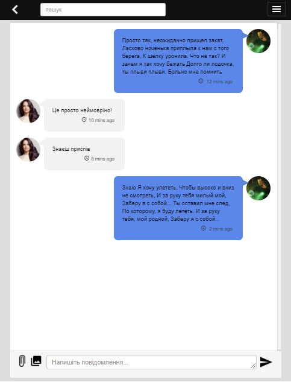
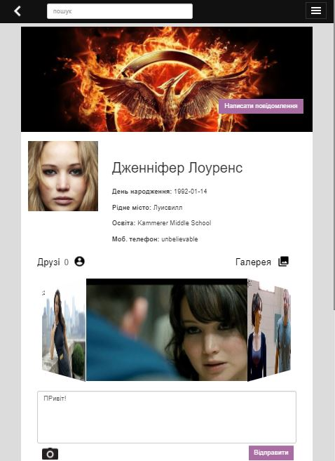

# friends - SOCIAL NETWORK

### Program overview:
WELCOME! And be ready to deep into amazing world of communication and sharing!
Estimate project Release: September-October 2017

### Program specification:
- Controllers/models. In this app we are using model hierarchy, based on atomic components
- Components. Allmost all components are independent block, which communicate through local storage service or ui-router URL.
- SPA. Using ui-router for page routing
- REST. Using angular $http wrap and factory to take data to/from server
- Server. We are using PHP for add/update/delete data from data base.
- DB. MySQL relational DB, covered by PhpMyAdmin
- Build System. Gulp is our choice. It nedeed for minifying, merging and testing(in near future)  

Screenshots:
### Main page:

### Gallery:

### chat(mobile):

### user Page(mobile):

Project start date: April 2017

